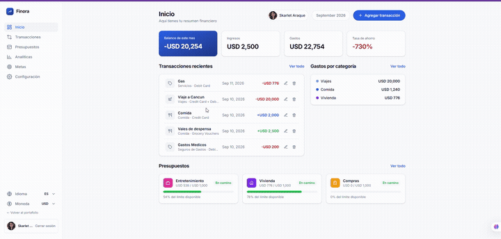
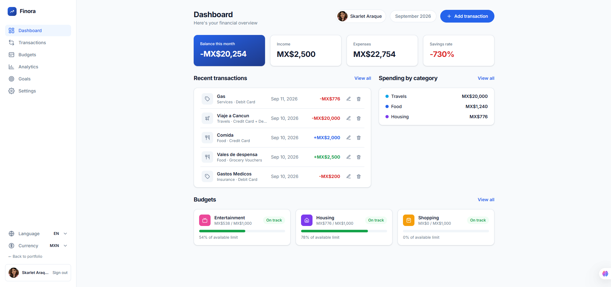
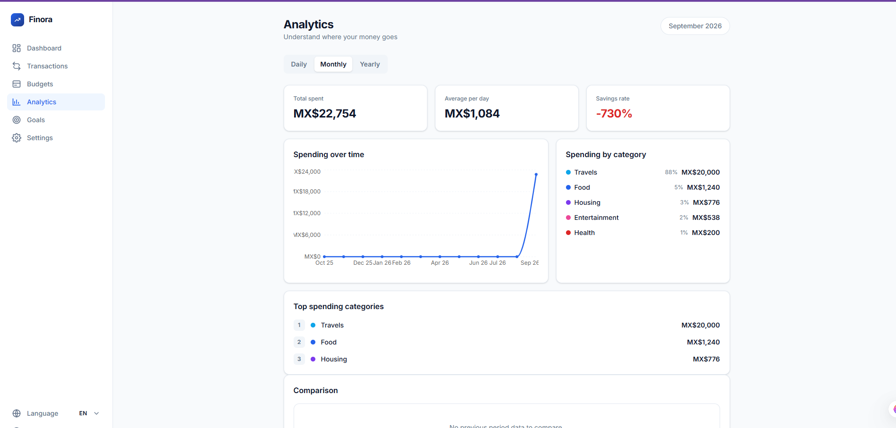
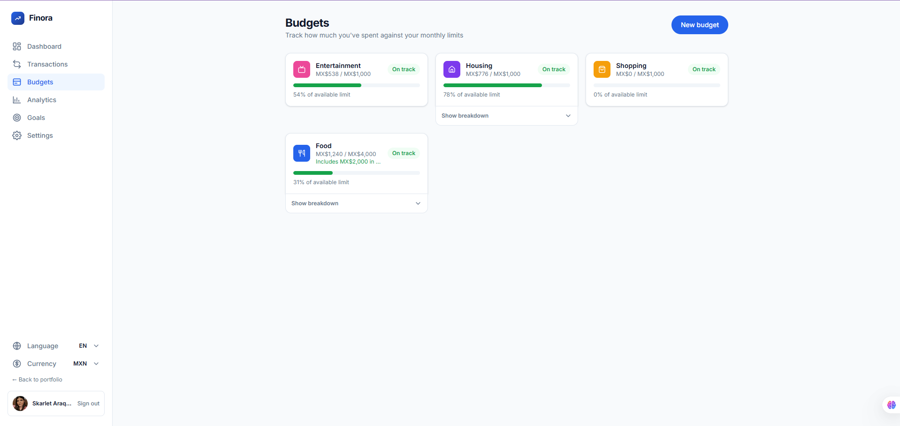
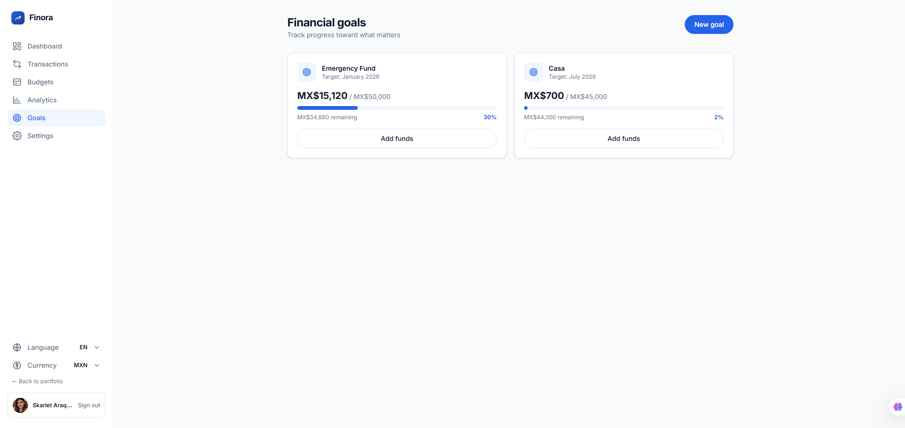
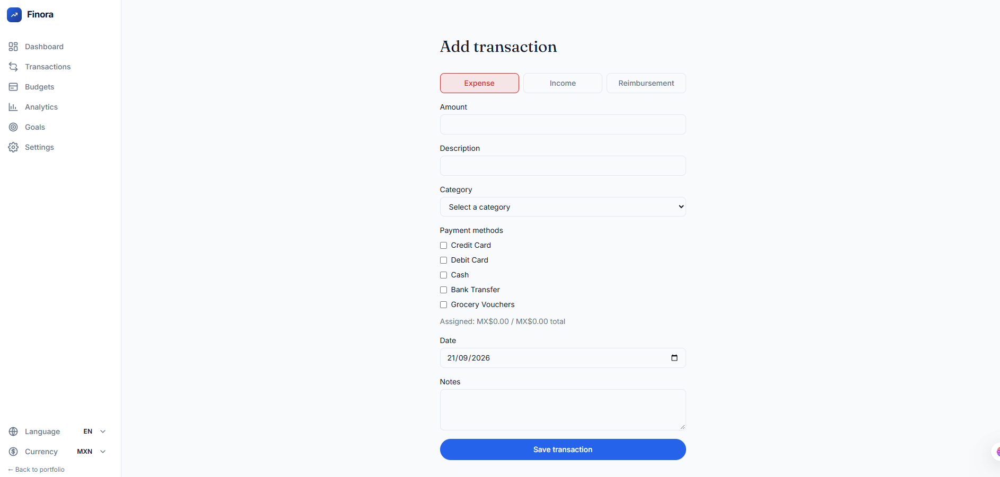
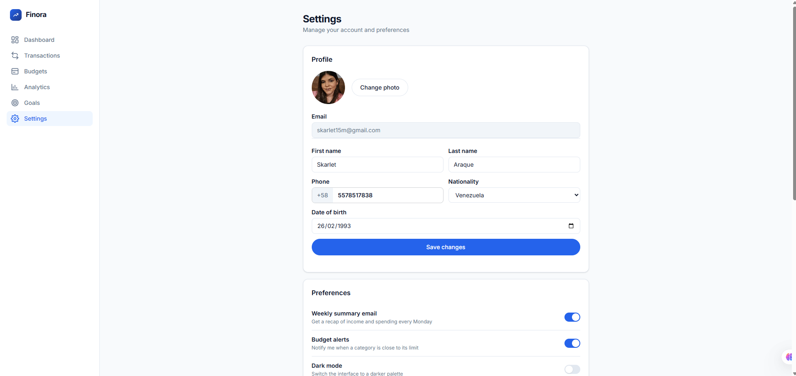

# Finora




<sub>Full screen recording (MP4, ~15 MB): [`finora_app.mp4`](../../assets/picture/finora_app.mp4)</sub>

## Index

1. [Overview](#1-overview)
2. [Screenshots](#2-screenshots)
3. [Architecture](#3-architecture)
4. [Features](#4-features)
5. [Tech Stack](#5-tech-stack)
6. [Running Locally](#6-running-locally)
7. [CI/CD](#7-cicd)
8. [Technical Decisions](#8-technical-decisions)
9. [Author](#9-author)
10. [License](#10-license)

---

## 1. Overview

Finora is a personal finance application for people who want a clear, manual picture of their income, expenses, budgets, and savings goals — without connecting a bank account. Every transaction is entered by hand, which keeps the data model simple and avoids the cost, complexity, and privacy trade-offs of a bank-aggregation provider (Plaid, Belvo, etc.).

It solves a narrow but real problem: most budgeting apps either require bank integration or are too generic (a spreadsheet) to model things people actually deal with — a purchase split across two payment methods, a reimbursed expense, a budget that has subcategories. Finora is built around those specifics.

Finora lives inside this portfolio as an independent application at `/finora` (see the [root README](../../../README.md) and [`CLAUDE.md`](../../../CLAUDE.md) for how the two boundaries are kept separate), and doubles as a case study in this portfolio: a from-scratch, production-shaped React + Supabase app with real architectural decisions behind it.

## 2. Screenshots

<table>
<tr>
<td align="center" width="50%">

<br /><sub>Dashboard — balance, recent transactions, spending by category, budgets</sub>
</td>
<td align="center" width="50%">

<br /><sub>Analytics — spending over time, top categories, period comparison</sub>
</td>
</tr>
<tr>
<td align="center" width="50%">

<br /><sub>Budgets — progress against monthly limits, per-subcategory breakdown</sub>
</td>
<td align="center" width="50%">

<br /><sub>Financial goals — progress toward a target amount and date</sub>
</td>
</tr>
<tr>
<td align="center" width="50%">

<br /><sub>Add transaction — expense / income / reimbursement, split across payment methods</sub>
</td>
<td align="center" width="50%">

<br /><sub>Settings — profile, preferences, language and currency</sub>
</td>
</tr>
</table>

## 3. Architecture

```text
Browser (React 19 + Vite)
        │
        ▼
Supabase
├── Auth        — email/password, email confirmation
├── Postgres     — transactions, categories, budgets, goals, profiles (RLS)
├── Storage      — user avatars
└── Edge Functions — delete-account (server-side account + data teardown)
```

Finora is a separate application boundary inside this portfolio's repository (`src/apps/finora/`), routed at `/finora` and lazy-loaded from the portfolio shell — see [`CLAUDE.md`](../../../CLAUDE.md) for the full boundary rules. Internally it follows **Atomic Design**:

```text
components/
├── atoms/       — Button, Input, Icon, Badge…
├── molecules/   — TransactionItem, BudgetCard, PreferenceDropdown…
└── organisms/   — AppShell, Sidebar…
```

Pages compose organisms and own page-level data/state; domain logic (money math, category rollups, validation) lives in framework-independent modules under `domain/`, so it's unit-testable without touching Supabase or React. All Supabase access goes through a `services/` layer — components never call `supabase` directly.

Two architecturally significant decisions are documented as ADRs:

- [ADR-001 — Net category spend calculation](../../../docs/adr/001-net-category-spend-calculation.md)
- [ADR-002 — Gross spend and effective budget limit](../../../docs/adr/002-gross-spend-and-effective-limit.md)

## 4. Features

- **Auth** — sign up, sign in, password reset, and account deletion, with email confirmation on sign-up.
- **Transactions** — expenses, income, and reimbursements; a single transaction can be split across multiple payment methods (e.g. part credit card, part grocery vouchers).
- **Budgets** — monthly limits per category, with subcategory support and a breakdown view; a reimbursement widens a budget's effective limit instead of silently shrinking its "spent" figure (see [ADR-002](../../../docs/adr/002-gross-spend-and-effective-limit.md)).
- **Analytics** — daily/monthly/yearly views, spending over time, top categories, and period-over-period comparison with plain-language insights.
- **Goals** — savings goals with a target amount, an optional target date, and manual fund contributions.
- **Multi-language** — English and Spanish, switchable instantly from anywhere in the app.
- **Dark mode** — instant theme toggle, persisted per user.
- **Configurable currency** — MXN, USD, or EUR display formatting, switchable instantly from anywhere in the app (see [§8](#8-technical-decisions) — this is formatting only, not real conversion).

## 5. Tech Stack

| Layer | Technology | Version |
|---|---|---|
| UI | React | 19.2.8 |
| Language | TypeScript | 7.0.2 |
| Build tool | Vite | 8.2.2 |
| Styling | Tailwind CSS | 4.3.3 |
| Backend | Supabase JS | 2.116.0 |
| Routing | React Router | 7.18.3 |
| i18n | i18next / react-i18next | 26.4.2 / 17.0.14 |
| Charts | Recharts | 3.10.1 |
| Icons | lucide-react | 1.44.0 |
| Class utilities | clsx | 2.1.1 |
| Testing | Vitest / React Testing Library / jest-dom | 5.0.0 / 16.3.3 / 7.0.1 |
| Test environment | jsdom | 30.0.1 |
| Component workshop | Storybook (`@storybook/react-vite`) | 10.6.0 |
| Linting | oxlint | 1.79.0 |

*(Versions as pinned in [`package.json`](../../../package.json) at the repository root — Finora shares one `package.json` with the portfolio.)*

## 6. Running Locally

```bash
git clone git@github.com:SkarletA/portafolio.git
cd portafolio
npm install
```

Create a `.env.local` file at the repository root with your own Supabase project's credentials:

```bash
VITE_SUPABASE_URL=<your-supabase-project-url>
VITE_SUPABASE_ANON_KEY=<your-supabase-anon-key>
```

Then:

```bash
npm run dev          # starts the portfolio + Finora at http://localhost:5173/finora
npx vitest run        # runs the test suite once
```

Finora's own Supabase schema (tables, RLS policies, the `delete-account` Edge Function) is managed outside this repository and isn't included here — without a matching project, auth and data calls will fail even though the app boots.

## 7. CI/CD

Every pull request runs through GitHub Actions ([`.github/workflows/ci.yml`](../../../.github/workflows/ci.yml)):

1. Install dependencies
2. Lint (`oxlint`)
3. Test with coverage (`vitest run --coverage`), with the coverage report commented on the PR
4. Build (`vite build`)

The portfolio (Finora included, as it's part of the same bundle) deploys automatically to **Vercel** on merge to `main`.

## 8. Technical Decisions

- **Gross spend, not net-of-reimbursements, for a budget's "spent" figure.** A reimbursement widens a budget's *effective limit* instead of netting into what's shown as already spent — the earlier net/floor approach could make a budget's headline number disagree with its own subcategory breakdown. See [ADR-001](../../../docs/adr/001-net-category-spend-calculation.md) and [ADR-002](../../../docs/adr/002-gross-spend-and-effective-limit.md) for the full reasoning and the edge cases it accounts for.
- **Currency selection is display-formatting only, not real conversion.** Switching between MXN/USD/EUR changes the symbol and number formatting (via `Intl.NumberFormat`) everywhere in the app instantly, but stored amounts are never converted. Real conversion would need a live exchange-rate feed and a decision about *when* a rate applies to a historical transaction — complexity and cost (and a provider dependency) that a single-currency personal-use app doesn't need yet.
- **No bank aggregation (Plaid, Belvo, etc.).** Transactions are entered manually by design. Bank aggregation is a recurring, per-connection cost and a much larger trust/security surface (storing or proxying bank credentials or tokens) that isn't justified for a personal finance tool where the user is already willing to log their own spending.
- **Domain logic as pure functions, decoupled from Supabase.** Money math and category rollups (`domain/category.ts`, `domain/budget.ts`, `domain/analytics.ts`) take and return plain values, with no dependency on the Supabase client or React. They're unit-tested directly with plain arrays, and both Budgets and Analytics call the same functions instead of each re-deriving the same math — which is what let ADR-002's bug (headline vs. breakdown disagreeing) be fixed in one place.

## 9. Author

**Skarlet Araque** — Product Tech Lead · Senior Frontend Developer

[](https://linkedin.com/in/skarlet-araque)
[](https://github.com/SkarletA)

## 10. License

**All rights reserved.** This is proprietary, source-available code shared as part of a professional portfolio — not open-source, and not licensed under MIT or any other open license. See [`LICENSE`](../../../LICENSE) for the full terms.
