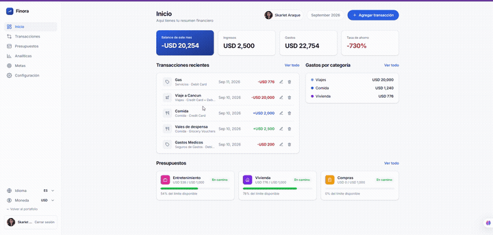
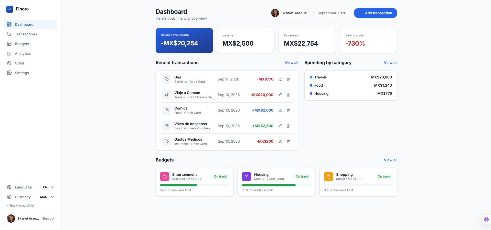
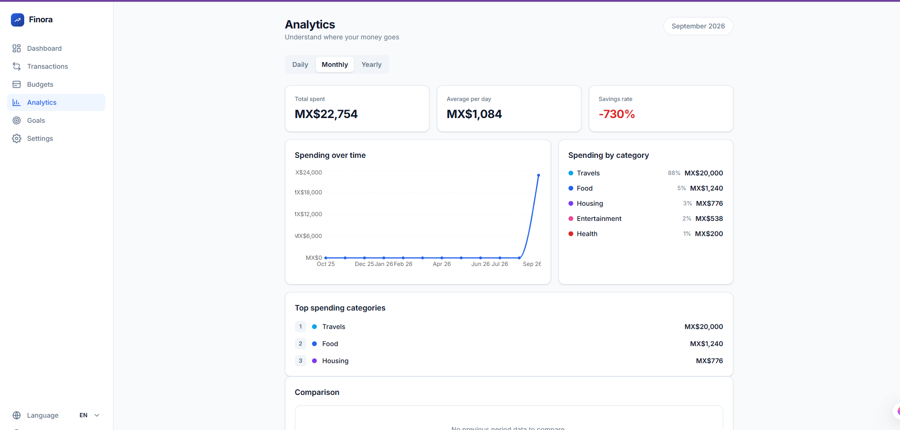
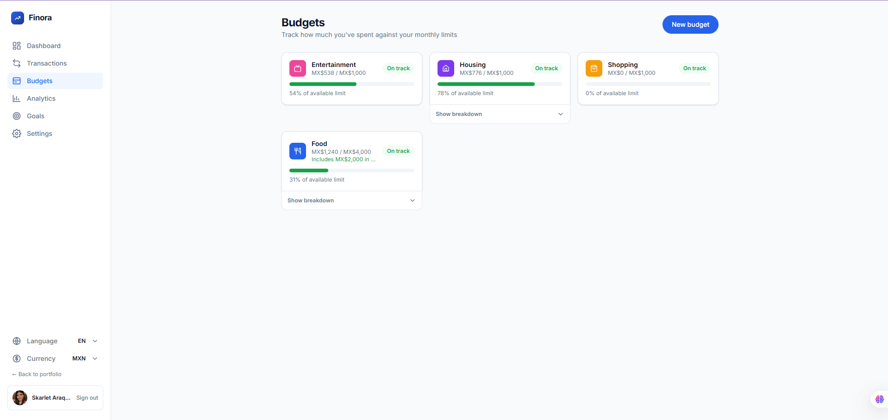
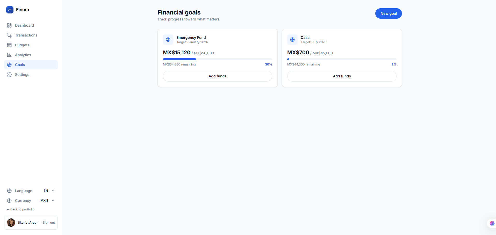
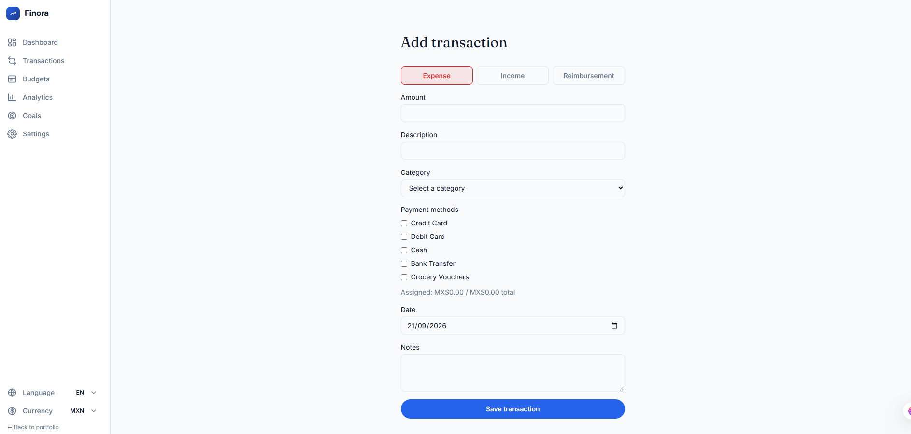
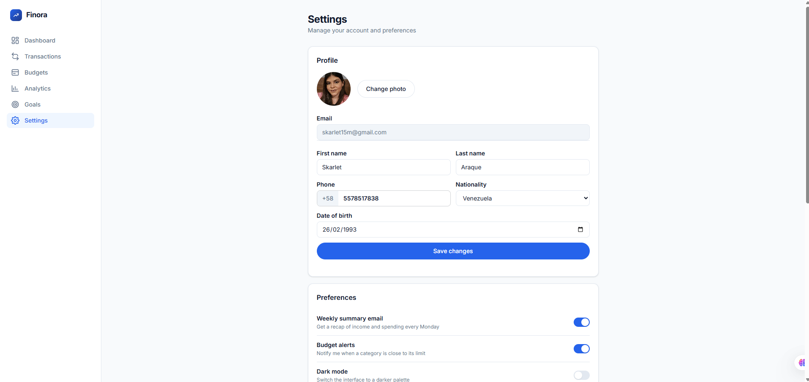

# Finora




<sub>Full screen recording (MP4, ~15 MB): [`finora_app.mp4`](../../assets/picture/finora_app.mp4)</sub>

## Index

1. [Overview](#1-overview)
2. [Screenshots](#2-screenshots)
3. [Architecture](#3-architecture)
4. [Process & Workflow](#4-process--workflow)
5. [Explore this Project Interactively](#5-explore-this-project-interactively)
6. [Features](#6-features)
7. [Tech Stack](#7-tech-stack)
8. [Running Locally](#8-running-locally)
9. [CI/CD](#9-cicd)
10. [Technical Decisions](#10-technical-decisions)
11. [Author](#11-author)
12. [License](#12-license)

---

## 1. Overview

Finora is a personal finance application for people who want a clear, manual picture of their income, expenses, budgets, and savings goals — without connecting a bank account. Every transaction is entered by hand, which keeps the data model simple and avoids the cost, complexity, and privacy trade-offs of a bank-aggregation provider (Plaid, Belvo, etc.).

It solves a narrow but real problem: most budgeting apps either require bank integration or are too generic (a spreadsheet) to model things people actually deal with — a purchase split across two payment methods, a reimbursed expense, a purchase financed in monthly installments, two partners splitting a household's bills. Finora is built around those specifics, including a full household mode where two people share visibility into their combined finances without losing their own.

Finora lives inside this portfolio as an independent application at `/finora` (see the [root README](../../../README.md) and [`CLAUDE.md`](../../../CLAUDE.md) for how the two boundaries are kept separate), and doubles as a case study in this portfolio: a from-scratch, production-shaped React + Supabase app with real architectural decisions behind it — 11 ADRs and counting (see [§3](#3-architecture)).

## 2. Screenshots

<table>
<tr>
<td align="center" width="50%">

<br /><sub>Dashboard — balance, recent transactions, spending by category, budgets</sub>
</td>
<td align="center" width="50%">

<br /><sub>Analytics — spending over time, top categories, period comparison</sub>
</td>
</tr>
<tr>
<td align="center" width="50%">

<br /><sub>Budgets — progress against monthly limits, per-subcategory breakdown</sub>
</td>
<td align="center" width="50%">

<br /><sub>Financial goals — progress toward a target amount and date</sub>
</td>
</tr>
<tr>
<td align="center" width="50%">

<br /><sub>Add transaction — expense / income / reimbursement, split across payment methods</sub>
</td>
<td align="center" width="50%">

<br /><sub>Settings — profile, preferences, household, language and currency</sub>
</td>
</tr>
</table>

## 3. Architecture

Finora is a separate application boundary inside this portfolio's repository (`src/apps/finora/`), routed at `/finora` and lazy-loaded from the portfolio shell — see [`CLAUDE.md`](../../../CLAUDE.md) for the full boundary rules.

### Request flow

```text
┌──────────────────────────────────────────────────────────────────┐
│ Browser (React 19 + Vite)                                        │
│                                                                    │
│  pages/        — compose organisms, own page-level state          │
│  components/   — Atomic Design: atoms → molecules → organisms     │
│  hooks/        — data-fetching + UI state (useBudgets, useGoals…) │
│  domain/       — pure functions, no Supabase/React dependency     │
│                  (money math, category rollups, attribution)      │
│  services/     — the ONLY layer that imports the Supabase client  │
└───────────────────────────────┬────────────────────────────────────┘
                                │ supabase-js
                                ▼
┌──────────────────────────────────────────────────────────────────┐
│ Supabase                                                          │
│  Auth           — email/password, email confirmation              │
│  Postgres (RLS) — transactions, transaction_shares, categories,   │
│                    budgets, goals, goal_transfers,                │
│                    household_members, profiles                    │
│  Storage        — user avatars                                    │
│  Edge Functions — delete-account (server-side account teardown)   │
└──────────────────────────────────────────────────────────────────┘
```

A page never calls `supabase` directly and never does its own money math — it asks a `services/` function for rows and a `domain/` function what they mean. That split is what let ADR-002's bug (a budget's headline number disagreeing with its own breakdown) be fixed in one place instead of several, and is why household attribution (below) is one function, not duplicated per page.

### Household read/write flow (ADR-007 → ADR-011)

Two people can form a household (one invites, the other accepts). From then on:

```text
Member A's rows ─┐
                  ├─► RLS: both members can SELECT each other's rows
Member B's rows ─┘      (household_member_ids(), ADR-007)
                              │
                              ▼
     services/transactionsService.ts: getHouseholdAttributedEntries(...)
      — queries, then calls the pure domain/transaction.ts:
        getHouseholdAttributedAmount(row, memberId) per row
                              │
          ┌───────────────────┼───────────────────┐
          ▼                   ▼                    ▼
   Case A: split         Case B: tagged      Untagged personal row
   (transaction_shares,  in full to one      → never counts toward
   ADR-009) — each        member (ADR-010)     the household, even
   member's own share                          the owner's own
```

RLS only decides who can **read** a row — write policies stay owner-only throughout (`auth.uid() = user_id`, every table). Visibility and ownership are deliberately different axes: a partner can see a shared budget but never edit or delete it (enforced in the UI too, not just trusted to RLS — see `BudgetCard`/`TransactionItem`'s ownership guards).

### ADRs

| ADR | Decides |
|---|---|
| [001](../../../docs/adr/001-net-category-spend-calculation.md) | Net category spend + subcategory rollup — **partially superseded by 002** |
| [002](../../../docs/adr/002-gross-spend-and-effective-limit.md) | A budget's "spent" is gross (expenses only); a reimbursement widens the *effective limit* instead of netting out |
| [003](../../../docs/adr/003-installments-and-savings-funding.md) | Financed purchases (1–48 monthly installments, derived at query time, never stored per-installment) and savings-funded expenses |
| [004](../../../docs/adr/004-goal-transfers.md) | One ledger (`goal_transfers`: deposit/withdrawal/opening_balance) instead of read-then-write balance updates that can lose a concurrent change |
| [005](../../../docs/adr/005-money-arithmetic-in-the-client.md) | Amounts stay plain `number`s in the client; a rule for when a sum must go through cents helpers instead of float comparison |
| [006](../../../docs/adr/006-reimbursement-purchase-links.md) | A reimbursement can optionally link to the purchase it refunds (many-to-one, partial refunds) |
| [007](../../../docs/adr/007-household-foundations.md) | Household membership and mutual read visibility via RLS |
| [008](../../../docs/adr/008-household-partner-profile-visibility.md) | What of a partner's profile (name, avatar) is visible, and from when (before acceptance too) |
| [009](../../../docs/adr/009-shared-expense-split.md) | Case A: a shared expense split between both members as two explicit amounts |
| [010](../../../docs/adr/010-household-expense-tag-and-household-budget.md) | Case B: an expense tagged as the household's in full (no split), and household budgets |
| [011](../../../docs/adr/011-household-combined-analytics.md) | Analytics/Dashboard combined for a household, with the same per-member attribution Budgets already used |

## 4. Process & Workflow

Finora went from a rough sketch to a high-fidelity prototype in [Figma](https://www.figma.com/design/WKQEa13ldPtPpgmw4zCxQ3/Finora) before any code was written, then built feature by feature guided by tasks tracked on a ClickUp board. Implementation itself was done with Claude Code, following the conventions and architectural rules documented in [`CLAUDE.md`](../../../CLAUDE.md).

## 5. Explore this Project Interactively

🤖 Ask questions about Finora's architecture, decisions, and implementation via its NotebookLM notebook: [Finora NotebookLM notebook](https://notebook.google.com/notebook/86c11272-f7e3-4d0b-bd58-aaad7af40b8d).

## 6. Features

- **Auth** — sign up, sign in, password reset, and account deletion, with email confirmation on sign-up.
- **Transactions** — expenses, income, and reimbursements; a single transaction can be split across multiple payment methods (e.g. part credit card, part grocery vouchers); financed purchases in monthly installments; an expense can be covered by savings instead of the month's income. A reimbursement can link to the specific purchase it refunds. Filterable by search, category, payment method, and month, all combinable.
- **Budgets** — monthly limits per category, with subcategory support and a breakdown view; create, edit, and delete; a reimbursement widens a budget's effective limit instead of silently shrinking its "spent" figure (see [ADR-002](../../../docs/adr/002-gross-spend-and-effective-limit.md)).
- **Analytics** — daily/monthly/yearly views, spending over time, top categories, and period-over-period comparison with plain-language insights; click a point on the trend chart to drill its category breakdown into that specific period.
- **Goals** — savings goals with a target amount, an optional target date, and deposits/withdrawals recorded on an atomic transfer ledger (no lost updates under concurrent changes, see [ADR-004](../../../docs/adr/004-goal-transfers.md)).
- **Household (shared accounts)** — invite a partner; once accepted, split a shared expense as two explicit amounts, or tag one as the household's in full; shared budgets; combined Analytics and Dashboard with each member's own attribution, never a blind merge (see [ADR-007](../../../docs/adr/007-household-foundations.md)–[011](../../../docs/adr/011-household-combined-analytics.md)). Visibility is RLS-wide; write access (edit/delete) always stays with whoever created the row.
- **Multi-language** — English and Spanish, switchable instantly from anywhere in the app.
- **Dark mode** — instant theme toggle, persisted per user.
- **Configurable currency** — MXN, USD, or EUR display formatting, switchable instantly from anywhere in the app (see [§10](#10-technical-decisions) — this is formatting only, not real conversion).
- **Per-route SEO + 404** — the portfolio and Finora each carry their own title, meta description, and favicon, switching on client-side navigation with no reload; an unmatched route under either boundary shows a contextual not-found page instead of a blank screen.

## 7. Tech Stack

| Layer | Technology | Version |
|---|---|---|
| UI | React | 19.2.8 |
| Language | TypeScript | 7.0.2 |
| Build tool | Vite | 8.2.2 |
| Styling | Tailwind CSS | 4.3.3 |
| Backend | Supabase JS | 2.116.0 |
| Routing | React Router | 7.18.3 |
| i18n | i18next / react-i18next / i18next-browser-languagedetector | 26.4.2 / 17.0.14 / 8.2.1 |
| Charts | Recharts | 3.10.1 |
| Icons | lucide-react | 1.44.0 |
| Class utilities | clsx | 2.1.1 |
| Testing | Vitest / React Testing Library / jest-dom | 5.0.0 / 16.3.3 / 7.0.1 |
| Test environment | jsdom | 30.0.1 |
| API mocking | msw / msw-storybook-addon | 2.15.0 / 3.0.3 |
| Component workshop | Storybook (`@storybook/react-vite`) | 10.6.0 |
| Linting | oxlint | 1.79.0 |

*(Versions as pinned in [`package.json`](../../../package.json) at the repository root — Finora shares one `package.json` with the portfolio.)*

## 8. Running Locally

```bash
git clone git@github.com:SkarletA/portafolio.git
cd portafolio
npm install
```

Create a `.env.local` file at the repository root with your own Supabase project's credentials:

```bash
VITE_SUPABASE_URL=<your-supabase-project-url>
VITE_SUPABASE_ANON_KEY=<your-supabase-anon-or-publishable-key>
```

Then:

```bash
npm run dev          # starts the portfolio + Finora at http://localhost:5173/finora
npx vitest run        # runs the test suite once
npm run storybook     # Finora's component workshop at http://localhost:6006
```

Finora's own Supabase schema (tables, RLS policies, the `delete-account` Edge Function) is managed outside this repository and isn't included here — without a matching project, auth and data calls will fail even though the app boots.

### Supabase auth configuration

The redirects in the email links are set in code (`src/apps/finora/services/authService.ts`) from `window.location.origin`. Supabase only accepts them when the URL is in its dashboard allowlist, and the **Site URL** sets where users land by default. This configuration lives in the Supabase dashboard (Authentication → URL Configuration), not in this repository, so it has to be set per project. A Site URL still set to `localhost:3000` caused a production bug where confirmation links pointed at localhost.

- **Site URL:** `https://portafolio-skarlet-a.vercel.app/finora`
- **Redirect URLs:**

| Environment | URL | Used by |
| --- | --- | --- |
| Production | `https://portafolio-skarlet-a.vercel.app/finora` | `signUp` (`emailRedirectTo`) |
| Production | `https://portafolio-skarlet-a.vercel.app/finora/reset-password` | `requestPasswordReset` (`redirectTo`) |
| Local | `http://localhost:5173/finora` | `signUp` (`emailRedirectTo`) |
| Local | `http://localhost:5173/finora/reset-password` | `requestPasswordReset` (`redirectTo`) |
| Local | `http://localhost:5173/**` | Any other development route |

*Optional, for Vercel preview deployments:* add `https://*-skarlet-a.vercel.app/**`. Supabase documents this pattern for Vercel previews (`https://*-<team-or-account-slug>.vercel.app/**`). Skip it unless you need auth flows on preview URLs; the production and local entries cover the rest.

## 9. CI/CD

Every pull request runs through GitHub Actions ([`.github/workflows/ci.yml`](../../../.github/workflows/ci.yml)):

1. Install dependencies
2. Lint (`oxlint`)
3. Test with coverage (`vitest run --coverage`), with the coverage report commented on the PR
4. Build (`vite build`)

The portfolio (Finora included, as it's part of the same bundle) deploys automatically to **Vercel** on merge to `main`.

## 10. Technical Decisions

- **Gross spend, not net-of-reimbursements, for a budget's "spent" figure.** A reimbursement widens a budget's *effective limit* instead of netting into what's shown as already spent — the earlier net/floor approach could make a budget's headline number disagree with its own subcategory breakdown. See [ADR-001](../../../docs/adr/001-net-category-spend-calculation.md) and [ADR-002](../../../docs/adr/002-gross-spend-and-effective-limit.md) for the full reasoning and the edge cases it accounts for.
- **One shared attribution primitive for household money, not one per page.** `getHouseholdAttributedAmount` (`domain/transaction.ts`, pure) decides how a shared or household-tagged row splits between two people; `getHouseholdAttributedEntries` (`services/transactionsService.ts`) queries the rows and applies it. The household budget, Analytics, and Dashboard all call the same two functions instead of each re-deriving the rule. A real bug (a Case A split counted in full under one member instead of split) was caught precisely because Budgets had already solved it and Analytics hadn't reused it yet — see [ADR-011](../../../docs/adr/011-household-combined-analytics.md).
- **Currency selection is display-formatting only, not real conversion.** Switching between MXN/USD/EUR changes the symbol and number formatting (via `Intl.NumberFormat`) everywhere in the app instantly, but stored amounts are never converted. Real conversion would need a live exchange-rate feed and a decision about *when* a rate applies to a historical transaction — complexity and cost (and a provider dependency) that a single-currency personal-use app doesn't need yet.
- **No bank aggregation (Plaid, Belvo, etc.).** Transactions are entered manually by design. Bank aggregation is a recurring, per-connection cost and a much larger trust/security surface (storing or proxying bank credentials or tokens) that isn't justified for a personal finance tool where the user is already willing to log their own spending.
- **Domain logic as pure functions, decoupled from Supabase.** Money math, category rollups, and household attribution (`domain/category.ts`, `domain/budget.ts`, `domain/analytics.ts`, `domain/transaction.ts`) take and return plain values, with no dependency on the Supabase client or React. They're unit-tested directly with plain arrays.

## 11. Author

**Skarlet Araque** — Product Tech Lead · Senior Frontend Developer

[](https://linkedin.com/in/skarlet-araque)
[](https://github.com/SkarletA)

## 12. License

**All rights reserved.** This is proprietary, source-available code shared as part of a professional portfolio — not open-source, and not licensed under MIT or any other open license. See [`LICENSE`](../../../LICENSE) for the full terms.
